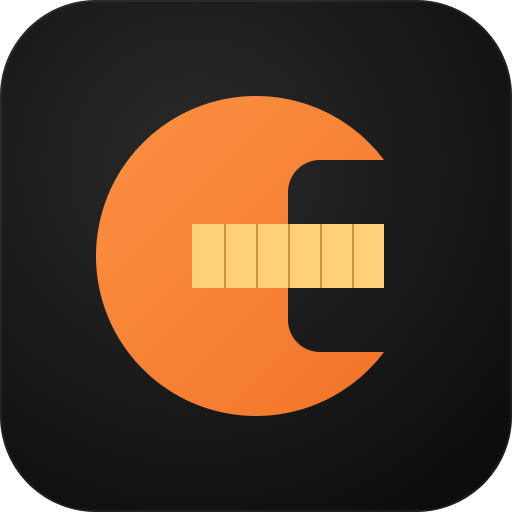
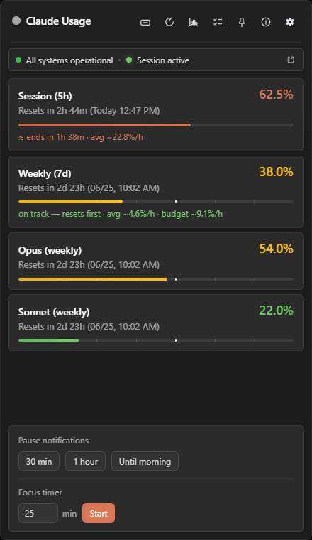
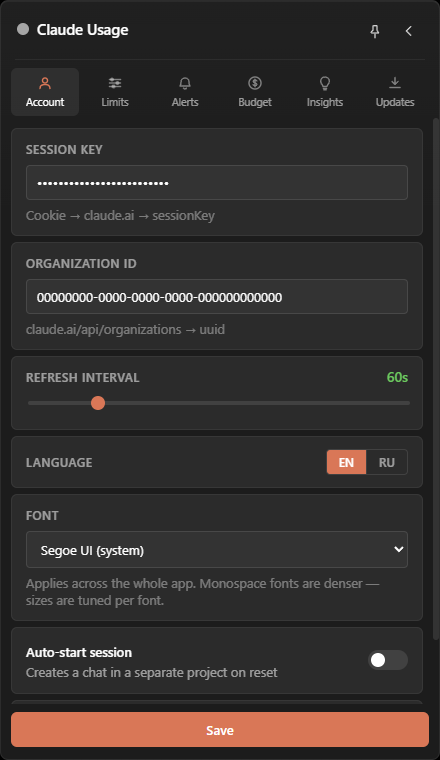
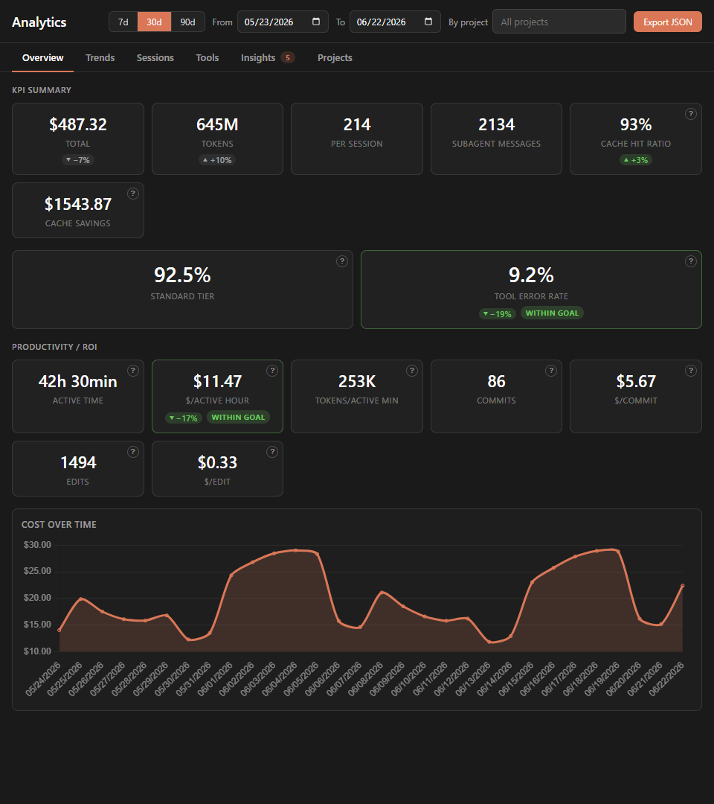
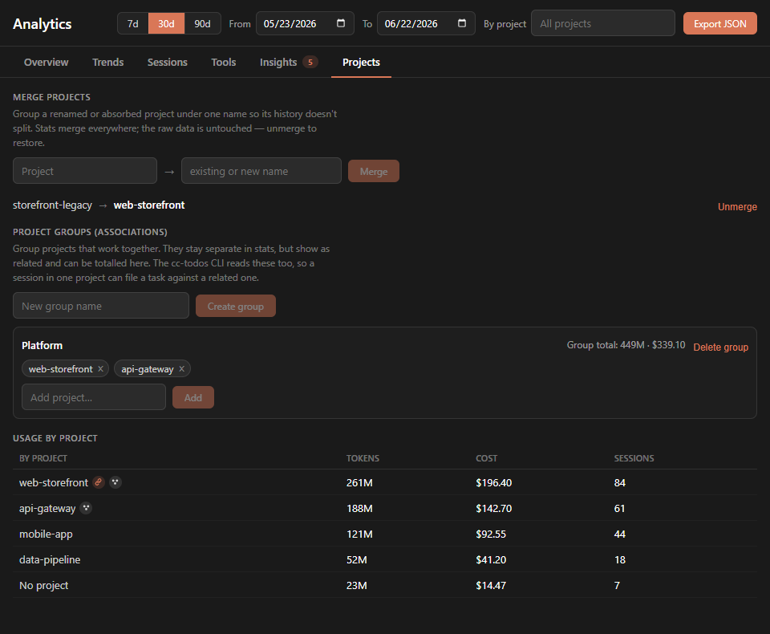
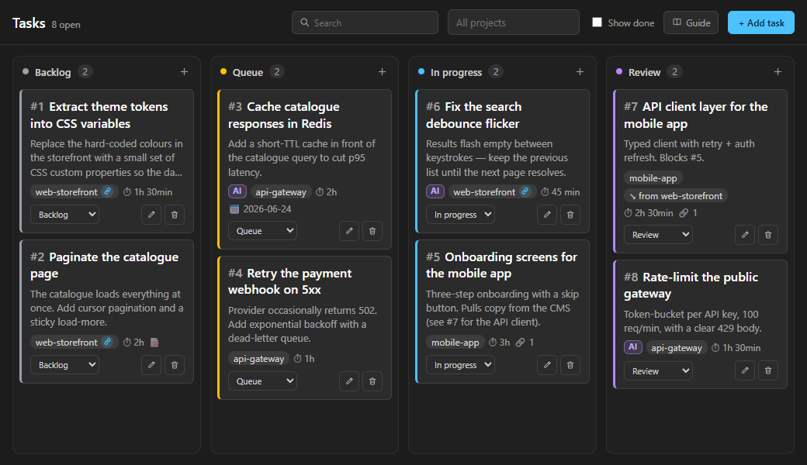

# Claude Usage Tracker for Windows

[](https://github.com/DamirSadykov/Claude-Usage-Tracker-Windows/actions/workflows/ci.yml)

<p align="center">
  
</p>

A Windows alternative to [Claude Usage Tracker](https://github.com/hamed-elfayome/Claude-Usage-Tracker) (macOS, Swift) — a native tray app for real-time monitoring of Claude AI usage limits.

The original tracker is macOS-only. This project brings the core functionality to Windows — and goes further with exhaustion forecasting, an efficiency-analytics window, and a built-in task manager that syncs with Claude Code — using **Tauri v2 + Vue 3 + Rust**.

## Features

### Usage monitoring
- **All limit tiers** — 5-hour session, weekly limit, plus Opus / Sonnet weekly tiers when your plan exposes them
- **Plan detection** — Pro / Max 5× / Max 20× inferred from the tiers the API returns
- **Extra usage & prepaid balance** — pay-as-you-go credits and prepaid balance shown when present
- **Countdown timer** — reset time displayed as "Resets in 4h 8m (Today 14:10)", with localized date formatting
- **Colour-coded levels** — per-tier thresholds you can tune for both the session and the weekly limit

### Forecasting & budgeting
- **Exhaustion forecast** — projects when each tier will run out from a rolling-average burn rate (configurable window), with an "ok / warn" pace indicator
- **Daily budget** — optional daily spend cap with a suggested amount that spreads the remaining weekly limit evenly until reset (in % of the limit, or in $ when Claude Code analytics is enabled)

### Efficiency analytics *(opt-in)*
A dedicated analytics window, fed by your local Claude Code data:
- **Cache efficiency, session quality, productivity / ROI** broken down into tabs
- **Charts** per model (Chart.js), token filters, project breakdowns, anomalous-session detection
- **Insights, trends and goals** — set a cost/hour or error-rate target and have the matching tiles flag when you miss it
- **Cold-rewrite tracking** with a per-cause breakdown
- **Runtime hints** — opt-in tips about the active session (long session, cold rewrites)
- **JSON export** of the underlying data

### Task manager — Claude Code integration
- **Built-in Kanban board** — 5 columns with drag-and-drop, live-reloading when the backing file changes
- **Auto-pickup from Claude Code** — TodoWrite tasks from your `.claude` transcripts surface automatically
- **`cc-todos` CLI + hook** — let a Claude Code session add tasks, move them across columns, and comment on them; install the CLI and hook straight from the app
- **Project links** — cross-project tasks, project groups, and merging of renamed/absorbed projects so they count as one
- **Notifications** when a task moves into review or done

### Notifications & focus
- Threshold and forecast alerts, configurable per tier and per alert type
- **Quiet hours** and a temporary mute / focus control
- **Claude service status** — polls [status.claude.com](https://status.claude.com) and notifies on incidents or degraded service

### Quality of life
- **System tray** — lives in the tray, doesn't occupy the taskbar; pin the flyout to keep it open
- **Mini widget** — a compact always-on-top window, optionally showing system CPU / RAM
- **UI font picker** with per-font sizing
- **Auto-updates** — in-app update banner, download and restart (signed update artifacts)
- **Crash / problem reporting** — diagnostics banner that can file a pre-filled GitHub issue
- **About panel** with the version history / changelog (generated by git-cliff)
- **Localization** — English and Russian

## Screenshots

Tray flyout & settings:

<p align="center">
  &nbsp;&nbsp;
  
</p>

Efficiency analytics:

<p align="center">
  
</p>

Per-project breakdown, merges & groups:

<p align="center">
  
</p>

Task manager (Kanban, synced with Claude Code):

<p align="center">
  
</p>

## Tech Stack

| Layer | Technology |
|-------|-----------|
| Native wrapper | [Tauri v2](https://v2.tauri.app/) |
| Backend (API requests, polling, alerting) | Rust + reqwest |
| System metrics | sysinfo |
| Frontend | Vue 3 + TypeScript + Vite |
| Charts | Chart.js |
| Localization | vue-i18n |
| Settings storage | tauri-plugin-store |
| Updates / notifications / lifecycle | tauri-plugin-updater, -notification, -process, -single-instance, -log |

## Installation

### Download

Grab the latest installer from the [Releases](https://github.com/DamirSadykov/Claude-Usage-Tracker-Windows/releases) page. The app auto-updates itself afterwards.

### Build from Source

#### Prerequisites

- [Node.js](https://nodejs.org/) 18+
- [Rust](https://rustup.rs/) 1.77+
- Windows 10/11 with WebView2 (pre-installed on Win 11)

```bash
git clone https://github.com/DamirSadykov/Claude-Usage-Tracker-Windows.git
cd claude-usage-tracker-windows
npm install
npm run tauri build
```

The installer will be available at `src-tauri/target/release/bundle/`.

### Development

```bash
npm run tauri dev
```

## Configuration

On first launch the settings panel opens:

1. **Session Key** — the `sessionKey` cookie from claude.ai
   - Open claude.ai → DevTools (F12) → Application → Cookies → `sessionKey`
2. **Organization ID** — your organization UUID
   - Navigate to `claude.ai/api/organizations` and copy the `uuid`
3. **Refresh interval** — how often to poll the API (10–300 sec, default 60)
4. **Auto-start session** — optionally create a chat automatically when the limit resets

Everything else (thresholds, alerts, quiet hours, analytics opt-in, daily budget, fonts, …) is optional and lives in the tabbed settings.

## Claude Code integration

The task manager can be driven from a Claude Code session via the bundled `cc-todos` CLI (the **Settings → install CLI + hook** button wires it up). Commands include:

- `add "<subject>" [--project <name>] [--description <text>]` — create a task in the backlog
- `set-status <id> <backlog|queue|in_progress|review|done>` — move a task across columns
- `comment add <id> --text "<body>"` — leave a note on a task's thread
- `list` / `related <project>` / `groups` — inspect tasks and project links

Tasks created in Claude Code (via TodoWrite) are also picked up automatically, so the board reflects what your agent is working on.

## How Auto-Start Works

When the 5-hour limit resets, the app can:
1. Find (or create) a project called "Usage Tracker - Auto Session"
2. Create a new chat with a "ping" message
3. Start a fresh 5-hour countdown (with retries if the first attempt fails)

All automatic chats are isolated in a separate project and won't clutter your normal conversations.

## Comparison with the Original

| | [Original (macOS)](https://github.com/hamed-elfayome/Claude-Usage-Tracker) | This project (Windows) |
|---|---|---|
| Platform | macOS 14+ | Windows 10/11 |
| Stack | Swift / SwiftUI | Tauri v2 / Vue 3 / Rust |
| Profiles | Multiple | Single |
| Menu bar icons | 5 styles | System tray + mini widget |
| Languages | 13 | English, Russian |
| Claude Code integration | Usage data | Task sync (Kanban + `cc-todos` CLI) |
| Exhaustion forecast | — | Yes |
| Efficiency analytics | — | Yes |
| Auto-start session | Yes | Yes |

## Security

- The Session Key is stored locally in the Tauri Store
- No data is sent to third-party servers
- The app only communicates with `claude.ai` and `status.claude.com`

## License

[Apache-2.0](LICENSE)
