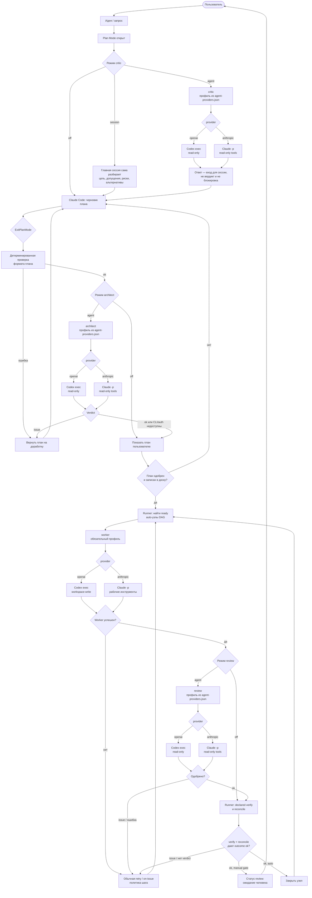

# Спека: модели, роли и поставщики

## routing — Маршрутизация обязанностей

part: требования
refs: tasks#fields

- Модель выбирается глобально по обязанности жизненного цикла, а не в задаче:
  `critic`, `architect`, `worker`, `review`. Полей `agent`, `provider` и
  `model` у задачи нет, поэтому смена модели не требует переписывать доску.
- У каждой обязанности одно поле `mode` — кто её выполняет. Допустимые
  значения объявлены по обязанностям: `critic` — `off | session | agent`;
  `architect` и `review` — `off | agent`; `worker` — только `always` (он и
  есть исполнитель, выключить нельзя). `off` — шаг не происходит; `session` —
  проход делает сама главная сессия, второй модели не тратя; `agent` —
  вызывается настроенная пара provider/model.
- Стартовая карта: `critic` — режим `session`, а под ним про запас настроен
  профиль `openai/gpt-5.6-terra` на случай переключения в `agent`;
  `architect` — режим `agent`, `openai/gpt-5.6-terra`; `worker` — режим
  `always`, `anthropic/sonnet`; `review` — режим `agent`, `anthropic/opus`.
- Provider и модель выбираются связанными списками. UI и CLI не сохраняют
  невозможные пары вроде `openai/opus`.
- Каждая строка настроек показывает полный id модели и окрашивает его по
  семейству.

## profiles — Настраиваемые роли

part: устройство

Карта лежит в локальном Tauri store с именем agents.json в каталоге
приложения, отдельно от settings.json: UI и CLI не переписывают
один файл конкурентно.
Ею управляет `cli agents`; стартовую карту можно восстановить командой
`cli agents init --force` или кнопкой в UI.

Режим обязанности — одно поле `mode`, а не булев флаг «хук включён» рядом с
отдельной настройкой для отдельной обязанности: обе формы раньше жили
порознь и покрывали не одно и то же (у критика была своя строка режима, у
прочих обязанностей — только вкл/выкл), из-за чего ни отрисовать, ни
задать режим одним и тем же кодом было нельзя. Чтение решения о режиме —
проверка допустимого значения, миграция более старых ключей конфигурации,
стартовое значение по обязанности — живёт в одном модуле; из него же берут
решение и Node CLI, и UI настроек, поэтому у них не может разойтись
понимание того, что означает `off`/`session`/`agent`/`always`. Команда
`cli agents mode <duty> <value>` задаёт поле напрямую; более старые
формулировки для тех же значений остаются рабочими алиасами.

Обязанность попадает в prompt отдельным блоком `ROLE`; она меняет способ
проверки и рассуждения, но не расширяет scope задачи и не даёт новых полномочий.

## hooks — Моменты вызова

part: устройство

Эта схема — канонический вид конвейера: она рисует обещанное поведение, а не
слепок конкретной установки. Фактическое состояние — какая пара
provider/model стоит у каждой обязанности сейчас, какая обязанность
выключена, разведён ли гейт плана в собственном settings.json Claude Code —
видно карточкой в приложении (вкладка Tasks настроек, следом за редактором
профилей): её узлы гаснут при `mode: off`, критик в режиме `session`
подписан главной сессией без модели, а гейт плана гаснет предупреждением,
если хуки не разведены. Расхождение между схемой и карточкой означает, что
код уехал вперёд спеки.

Роль выбирается один раз на каждом подключении из карты `agent-providers.json`
(манифест допустимых provider/model и стартовых значений) поверх
пользовательской карты в `agents.json`: задача хранит только работу и
зависимости, а не provider/model. `architect` и `review` живут в режиме
`off | agent` с fail-open при недоступности CLI или auth; `worker` — только
`always`. Все фактические вызовы пишут resolved provider/agent/model и
session id в журнал task-session.

`critic` — настраиваемая duty для разбора идеи на входе в Plan Mode: она
проверяет цель, допущения, риски и альтернативы, но не создаёт задач и не
меняет доску. В режиме `session` разбор ведёт сама главная сессия — второй
модельный вызов не тратится, шаг выполняется как часть обычного рассуждения
сессии, направленного инструкцией, впрыснутой при старте сессии. В режиме
`agent` критик вызывается синхронно на первом prompt, отправленном при уже
открытом Plan Mode (`permission_mode: plan`) — один раз за сессию, тем же
проходом, что впрыскивает формат плана. Ответ добавляется в контекст ДО того,
как сессия составит текст плана, и является входом для рассуждения, а не
вердиктом: он не блокирует и не заворачивает работу назад к пользователю —
эту роль в конвейере несёт architect-гейт ниже. Провал вызова (недоступный
CLI, таймаут, ошибка провайдера) — тихий: сессия продолжает планирование без
критик-контекста, поскольку хук блокирующий и ограничен потолком времени
харнесса.

`cli hook --host codex` отдаёт тот же task-контекст и фактическую конфигурацию
ролей через Codex `SessionStart`, но использует отдельную формулировку процесса.
Она не обещает `EnterPlanMode`/`ExitPlanMode`, Claude `plan-guard` или
автоматический вызов архитектора: эти механизмы принадлежат Claude Code.
После Codex compaction тот же контекст восстанавливает повторный
`SessionStart(source=compact)`.
Хук ставится из окна настроек той же кнопкой-соседом Claude-установщика:
приложение пишет запись в `~/.codex/hooks.json` (матчер
`startup|resume|clear|compact`, таймаут 30 с, потолок впрыскиваемого контекста
12000) и не трогает `config.toml` — доверие новому хуку Codex запрашивает сам
при следующем старте и хранит его хэш у себя. Переустановка перенацеливает
путь, чужие хуки в файле сохраняются.

- `critic` вызывается хуком `UserPromptSubmit` на первом prompt, отправленном
  при уже открытом Plan Mode; в режиме `session` вызова нет вовсе.
- `architect` вызывается хуком `PreToolUse · ExitPlanMode` после
  детерминированной проверки формата и до показа плана пользователю. Verdict
  `issue` блокирует выход; недоступность CLI/auth работает fail-open.
- `worker` вызывается раннером автоматически для каждого готового шага DAG.
- `review` вызывается после успешного worker и до `verify`/reconcile. Verdict
  `issue` входит в обычную retry/on-issue политику шага.
- Режим каждой из трёх отключаемых обязанностей меняется независимо от
  остальных; `worker` — единственная, у которой значение всего одно
  (`always`), поэтому выключить его нельзя.

## executors — Адаптеры CLI

part: устройство

Единый адаптер поставщиков — одно место, знающее синтаксис CLI каждого
провайдера: он собирает argv по профилю обязанности, приводит вывод CLI к
общей форме `{sessionId, answer, usage, error, costUsd}` и, для Codex, ловит
идентификатор нити в потоке событий по мере их поступления (нужно, чтобы
раннер мог привязать сессию к задаче ещё до завершения долгого шага). До
этого адаптера сборка argv и разбор вывода были продублированы по числу
вызывающих мест — worker и review для обоих поставщиков плюс синхронный
вызов роли для критика и архитектора, — и расходились по мелочи: не все
вызовы одинаково передавали ограничения инструментов и id сессии.

- `anthropic` запускает `claude -p --output-format json`, принимает заранее
  выбранный session id и список разрешённых инструментов.
- `openai` запускает `codex exec --json --sandbox <sandbox>`, передаёт модель
  и reasoning effort профиля, извлекает thread id, финальное сообщение и usage
  из JSONL-событий.
- Различие read-only/workspace-write — явный параметр `sandbox` с
  ограниченным списком допустимых значений; неизвестное значение адаптер
  отвергает отказом, а не пропускает как есть в CLI поставщика.
- Планировщик DAG не знает синтаксис поставщиков: он передаёт задаче единый
  executor seam и получает `{sessionId, costUsd, handoff, ok}`. Спавн процесса,
  привязка сессии, подсчёт стоимости и retry остаются на стороне раннера —
  это вопросы ЗАПУСКА, а не поставщика, и они одинаковы для обеих CLI.
- Каждый запуск пишет в task-session journal resolved provider/agent/model.
- Дочерний процесс получает свою обязанность через окружение, а не через
  текст промпта: `TRACKER_DUTY` — роль профиля (`critic`, `architect`,
  `worker`, `reviewer`), `TRACKER_SESSION_KIND=runner` — признак, что сессия
  запущена трекером, а не человеком. Это публичный контракт для внешних
  хуков сессии: они читают обязанность отсюда и не выводят её из модели;
  имена переменных стабильны и меняются только с версией спеки.

## telemetry — Локальная телеметрия

part: требования
refs: usage-tracker#analytics, tasks#cost

Opt-in аналитика сканирует оба локальных источника: Claude transcripts и Codex
`sessions/**/rollout-*.jsonl` плюс `archived_sessions`. Из Codex берутся
`session_meta`, `turn_context`, `token_count.info.last_token_usage` и последний
`token_count.rate_limits`; prompt, ответы, tool payload и auth-данные не читаются
и не сохраняются.

`input_tokens` Codex включает cached input, поэтому при нормализации fresh input
равен `input - cached - cache_write`. Reasoning уже входит в output и второй раз
не тарифицируется. В SQLite остаются общие оси input/output/cache/model/session,
так что существующие графики и task-cost join работают без отдельной ветки UI.

## codex-limits — Лимиты подписки Codex

part: устройство

Последний локальный `token_count.rate_limits` служит источником плашек Codex.
Показываются primary-окно (обычно 300 минут), secondary-окно (обычно 10080
минут), процент расхода, остаток, абсолютное время и обратный отсчёт до сброса,
тип плана и достижение лимита. Плашки обновляются после новых событий Codex и
периодическим локальным сканированием; сетевой API и admin key не требуются.

Формат rollout является локальным форматом Codex, поэтому неизвестные или
частично отсутствующие поля игнорируются без падения всего usage dashboard.
